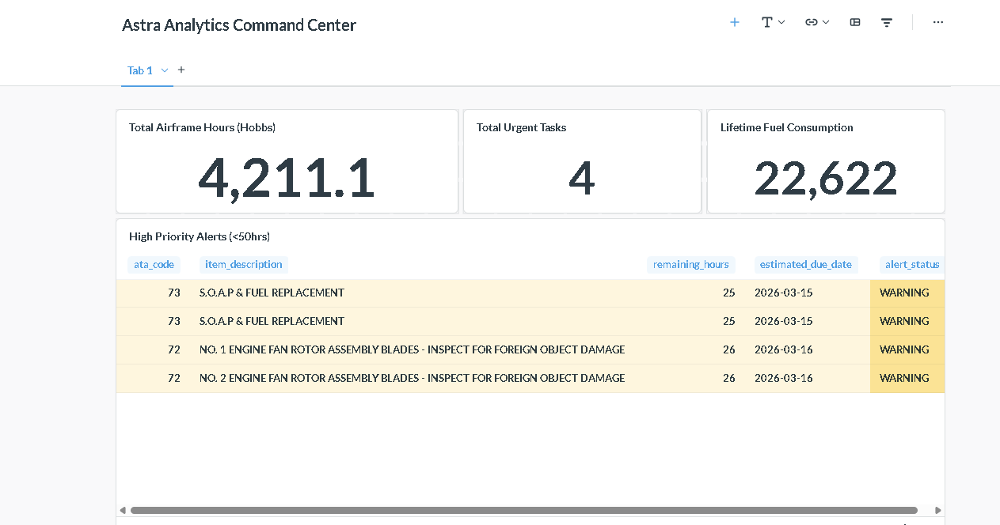
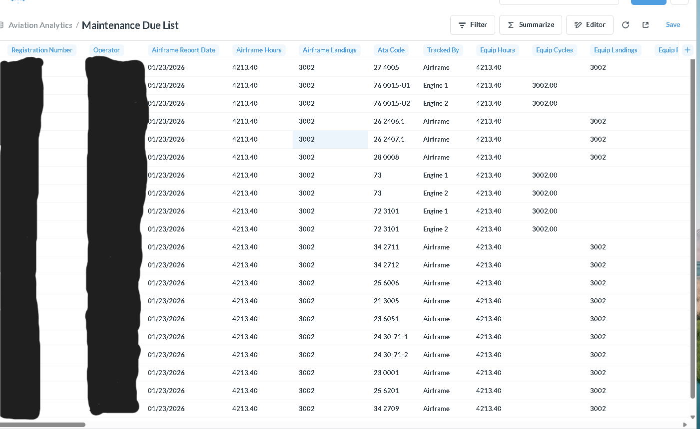
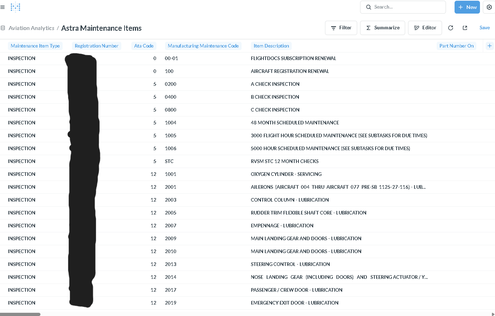

# XA: Aviation Maintenance Analytics ✈️
A Dockerized Business Intelligence (BI) stack for tracking Astra aircraft maintenance.

## 🚀 Overview
Converted a standalone analytics tool into a scalable, containerized environment. This project tracks over 1,000 maintenance logs across 96 data columns to provide real-time aircraft health insights, specifically optimized for mobile access in the hangar.

## 📱 Remote Access
This dashboard is deployed via **Docker** and secured using **Tailscale Networking**. It is accessible from any authorized device (iPhone, iPad, or remote laptop) on the private tailnet without exposing ports to the public internet.

* **Internal URL:** `http://xa:3000`
* **Network Provider:** Tailscale (MagicDNS enabled)
* **Encryption:** WireGuard (End-to-End)

## 🛠 Technical Stack
* **Containerization:** Docker & Docker Compose for rapid deployment.
* **BI Tool:** Metabase for interactive SQL-based dashboarding.
* **Networking:** Tailscale Mesh VPN for secure, remote mobile access.
* **Database:** Relational SQL schema tracking ATA Chapters (05, 12, 24, 32, 34, 72, 73).
* **Hardware:** Optimized for high-speed I/O on NVMe storage (Samsung 990 PRO).

## 📊 Analytics Preview
**This project transforms raw aviation data into actionable maintenance intelligence. Below are the key components of the system, from server initialization to the final command center.

### 🖥️ Maintenance Command Center
The primary dashboard provides real-time tracking of airframe hours (4,211.1 Hobbs), fuel consumption, and high-priority maintenance alerts for ATA 72/73 components.


### 📋 Maintenance Due List
A comprehensive overview of upcoming service requirements, inspections, and component life limits.


### 🗄️ Maintenance Item Master Data
Detailed view of the 90+ data points tracked for every serialized component on the aircraft, ensuring full regulatory compliance.


---

## 📋 Getting Started (From Scratch)

### 1. Prerequisites
* Ubuntu server with Docker and Docker Compose installed.
* A Tailscale account with MagicDNS enabled.

### 2. File Structure
```text
aviation_analytics/
├── docker-compose.yml
├── metabase.db/        # Your H2 or Postgres database files
└── README.md

##  **Deployment**
* Run the following command to pull the images and start the analytics engine:
* docker compose up -d
*Once initialized, access the setup wizard at http://xa:3000 or your local MagicDNS name.

